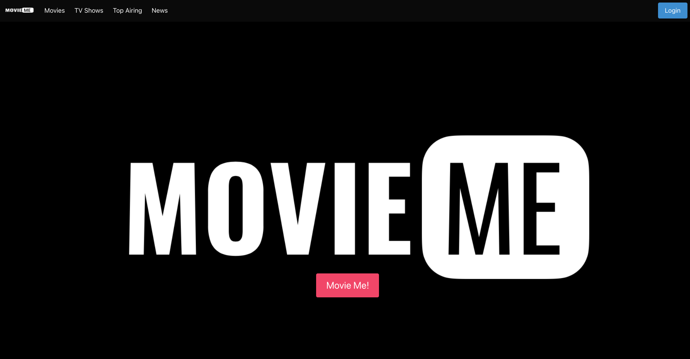
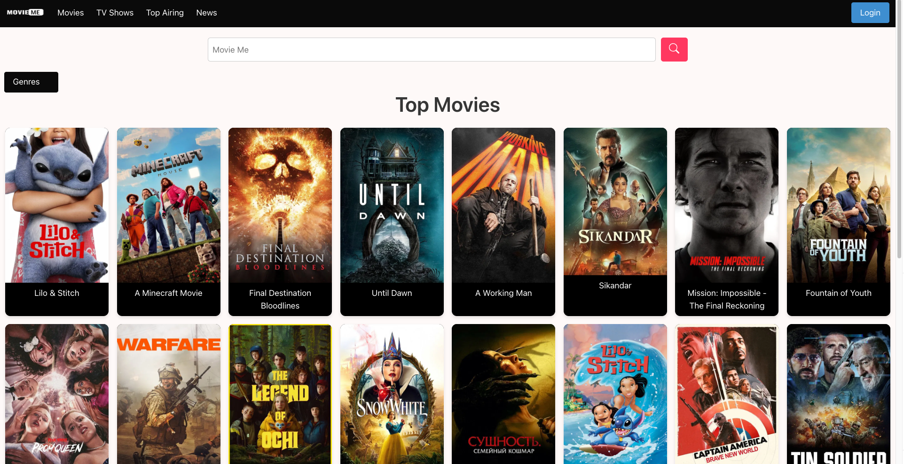
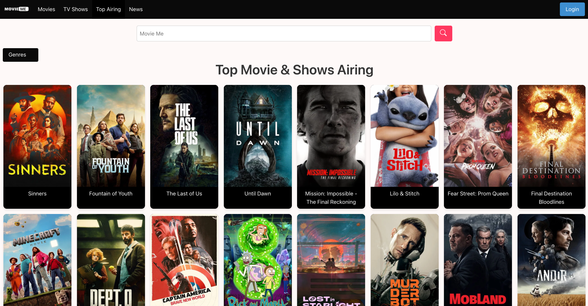
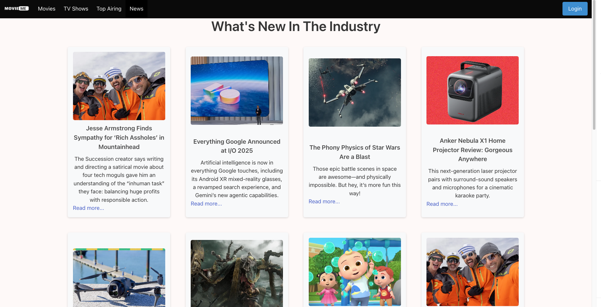
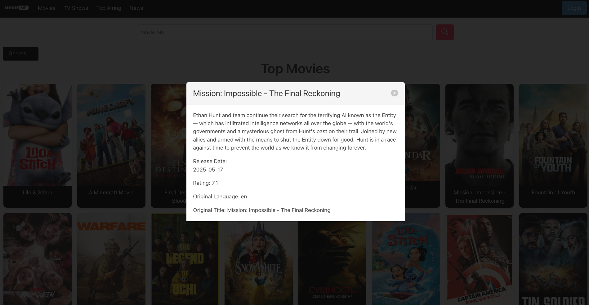

## Hi there 👋

<h2>🎬 My First Website: Movie Me</h2>

This was my first university project — a website for exploring movies, getting news, and pulling data via APIs. All frontend and API integration was done from scratch. I'm really proud of this!

<!-- Trigger image to open full view -->

